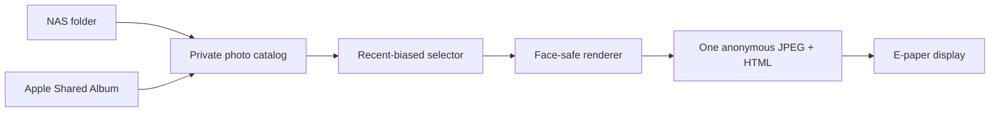

# FrameFeed

[](https://github.com/rohanpandula/framefeed/actions/workflows/ci.yml)
[](https://github.com/rohanpandula/framefeed/releases)
[](LICENSE)

**A privacy-first photo pipeline for e-paper and other slow displays.**

FrameFeed turns a local photo folder—or an optional Apple Shared Album—into one
carefully composed, static image page. It favors recent photos without forgetting
old ones, keeps faces in frame, avoids distorted aspect ratios, and preserves the
last good image when a source is unavailable.

> **v0.1 is an early release.** Back up your configuration, review the security
> notes, and expect a few rough edges.

## Why I made it

I bought a Seeed Studio reTerminal E1004 for my parents, who are in their
seventies, so new photos of their granddaughter could simply appear at home.
They should not need another app, account, or set of instructions just to enjoy
family pictures. FrameFeed grew from that small, personal goal.

## Features

- Mirrors a NAS folder or an experimental Apple Shared Album public website.
- Runs face detection locally with the compact, MIT-licensed OpenCV YuNet model.
- Crops toward faces without stretching photos; falls back to the complete image
  over a blurred background when a safe crop would discard too much.
- Shows a newly discovered photo for 65 minutes, then returns to a deterministic,
  recency-weighted shuffle with a 24-photo no-repeat window.
- Writes face boxes, layout decisions, and descriptions to a private JSONL cache.
- Publishes only an anonymous rendered JPEG and tiny HTML page at a secret path.
- Keeps the last successful frame online during source or detector outages.
- Includes landscape and portrait presets for the reTerminal E1004.
- Runs as non-root containers with read-only web serving and no directory listing.

## How it works



Original images and analysis metadata stay on your server. The display receives
only the current pre-rendered frame.

## Prerequisites

- Docker Engine with Docker Compose v2; Unraid is supported.
- A folder of JPEG, PNG, HEIC, HEIF, or WebP images.
- About 1 GB of free space for the container image and local state.
- An HTTPS reverse proxy, VPN, or private LAN if the display is outside your home.

## Installation

Clone the project and create the private settings:

```bash
git clone https://github.com/rohanpandula/framefeed.git
cd framefeed
./scripts/init.sh
```

Open `.env` and set `PHOTO_DIR_HOST` to your photo folder. For Unraid, it may look
like this:

```dotenv
PHOTO_DIR_HOST=/mnt/user/photos/family-frame
```

Start FrameFeed:

```bash
docker compose up -d
```

The setup script prints the private frame URL. To print it again:

```bash
printf 'http://YOUR-SERVER-IP:8080/%s/\n' "$(sed -n '1p' secrets/frame_path)"
```

Put a test photo in your source folder, wait up to five minutes, and open that URL.
For a copy-and-paste Unraid walkthrough, see [Unraid setup](docs/unraid.md).

## Apple Shared Album source

FrameFeed does **not** need your Apple ID, password, 2FA code, or `icloudpd`. It can
read a Shared Album only after you deliberately enable Apple's **Public Website**
option. Paste that public URL into the local secret file:

```bash
printf '%s\n' 'https://www.icloud.com/sharedalbum/#YOUR_ALBUM_ID' \
  > secrets/icloud_shared_album_url
docker compose restart worker
```

Anyone who obtains the Apple public-album URL can view that album. Read
[Apple Shared Albums and privacy](docs/apple-shared-albums.md) before enabling it.

## Display setup

For a landscape reTerminal E1004:

1. Keep `FRAME_WIDTH=1600` and `FRAME_HEIGHT=1200` in `.env`.
2. In SenseCraft HMI, add a **Web** widget.
3. Choose **Live iframe** as the render mode.
4. Set preview width to `1600` and preview height to `1200`.
5. Paste the private HTTPS frame URL and publish it to the device.

If the device is rotated, copy the values from
[`presets/reterminal-e1004-portrait.env`](presets/reterminal-e1004-portrait.env).
More detail is in [reTerminal E1004 setup](docs/reterminal-e1004.md).

## Selection logic

FrameFeed makes the rotation feel shuffled while giving recent additions more
chances to appear:

```text
weight(age in days) = 1 + 6 × e^(-age / 21)
```

A photo added today has weight 7. The extra bias decays over roughly three weeks;
months-old photos approach the same baseline weight. The choice is stable within
each rotation window, so restarts do not unexpectedly change the frame.

## Configuration

| Setting | Default | Purpose |
| --- | ---: | --- |
| `FRAME_WIDTH` / `FRAME_HEIGHT` | `1600` / `1200` | Rendered frame size |
| `ROTATION_SECONDS` | `3600` | Normal display time |
| `NEW_PHOTO_HOLD_SECONDS` | `3900` | Time reserved for a new photo |
| `SCAN_INTERVAL_SECONDS` | `300` | Folder scan frequency |
| `MIN_CROP_RETAINED_FRACTION` | `0.75` | Use contain mode below this safe-crop fraction |
| `FACE_DETECTOR` | `yunet` | `yunet`, `immich`, or `none` |
| `FACE_MARGIN_RATIO` | `0.75` | Space protected around detected faces |
| `ANALYSIS_BATCH_SIZE` | `8` | Background analyses per scan |
| `PUID` / `PGID` | `1000` / `1000` | Host ownership used by the worker (`99` / `100` on Unraid) |

All options and comments are in [`.env.example`](.env.example).

## Security

The generated path is deliberately difficult to guess, and FrameFeed removes
source filenames and disables indexing. Treat the path like a password: anybody
who has it can see the current picture.

For access beyond a trusted LAN, put FrameFeed behind Cloudflare Access, Tailscale,
or another authenticated reverse proxy. An IP allow-list is useful as an extra
layer, but residential IPs can change and should not be the only control. Never
port-forward the worker container or expose `data/state`, `secrets`, or the source
photo folder. See [SECURITY.md](SECURITY.md) for the threat model and reporting.

## Development

```bash
python3 -m venv .venv
. .venv/bin/activate
python -m pip install -e '.[dev]'
ruff check .
pytest
```

Run one local update with environment variables pointing at writable test folders:

```bash
framefeed --once
```

The architecture and state files are documented in [docs/architecture.md](docs/architecture.md).

## Contributing

Bug reports and focused pull requests are welcome. Please read
[CONTRIBUTING.md](CONTRIBUTING.md) and avoid attaching private family photos,
album URLs, frame secrets, or server addresses to issues.

## Roadmap

- Authenticated photo sources such as Immich and generic WebDAV.
- A small local setup/status page that never handles the display traffic.
- Multiple displays and independent playlists.
- Optional scene labels without identity recognition.

## License

FrameFeed is licensed under the [Apache License 2.0](LICENSE). The bundled YuNet
model is MIT-licensed; its attribution is in [NOTICE](NOTICE) and
[`models/YUNET_LICENSE`](models/YUNET_LICENSE).

FrameFeed is an independent project and is not affiliated with Apple, Seeed Studio,
OpenCV, Cloudflare, or Immich.
